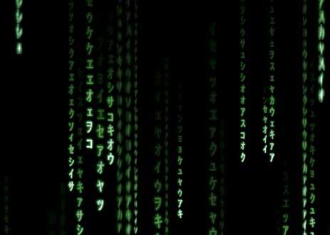



## MATRIX\-Fall in DX8 \+ real caracters

### Description

the new version can be found here : http://www.planet-source-code.com/vb/scripts/ShowCode.asp?txtCodeId=47678&lngWId=1

It simulates the fall of caracters in Matrix.

It's my first program with DirectX 8 but I think it's a good beginning.

See it by yourself and tell me what you think.

a+
 
### More Info
 

             |
---                |---
**Submitted On**   |2003-08-07 20:01:00
**By**             |[NoRabbit](https://github.com/Planet-Source-Code/PSCIndex/blob/master/ByAuthor/norabbit.md)
**Level**          |Intermediate
**User Rating**    |5.0 (60 globes from 12 users)
**Compatibility**  |VB 6\.0
**Category**       |[Graphics](https://github.com/Planet-Source-Code/PSCIndex/blob/master/ByCategory/graphics__1-46.md)
**World**          |[Visual Basic](https://github.com/Planet-Source-Code/PSCIndex/blob/master/ByWorld/visual-basic.md)
**Archive File**   |[MATRIX\-Fal162571872003\.zip](https://github.com/Planet-Source-Code/norabbit-matrix-fall-in-dx8-real-caracters__1-47496/archive/master.zip)

